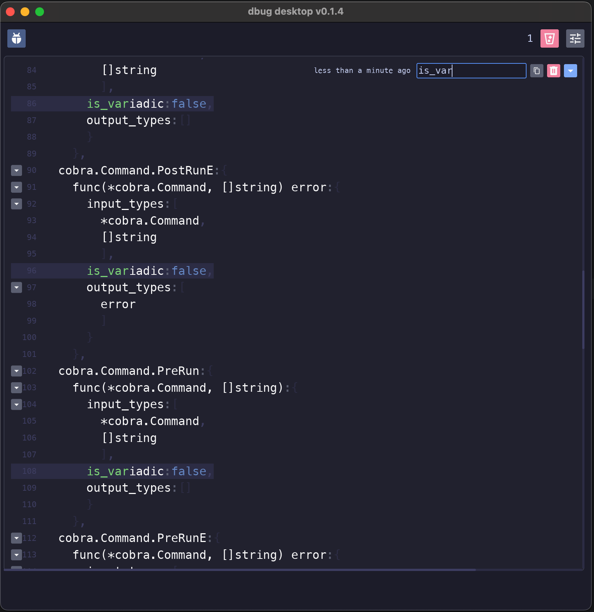

# Dbug Desktop




Dbug Desktop is a desktop application built with Rust, using the `iced` GUI library and `tokio` for asynchronous operations. It allows users to view and manage JSON data sent via HTTP POST requests.

## Features

- Automatically refreshes the GUI when new JSON data is received.
- Displays JSON objects in a scrollable list, sorted by the newest first.
- Allows filtering, expanding, and deleting JSON objects.
- Simple and clean user interface.

## Installation

To build and run the application, ensure you have Rust and Cargo installed. You can install Rust using [rustup](https://rustup.rs/).

```bash
# Clone the repository
git clone https://github.com/yourusername/dbug-desktop.git
cd dbug-desktop

# Build the application
cargo build --release
```

## Execution

To run the application, execute the following command:

```bash
cargo run --release
```

The application will start an HTTP server on `http://127.0.0.1:53821`. You can send JSON data to this server using HTTP POST requests.

## Usage

- **Filter JSON Objects:** Use the filter input to search through JSON objects.
- **Expand/Collapse JSON:** Click the arrow next to each JSON object to expand or collapse its view.
- **Delete JSON Objects:** Click the trash icon to delete a JSON object.

## Contributing

Contributions are welcome! Please follow these steps to contribute:

1. Fork the repository.
2. Create a new branch for your feature or bugfix.
3. Make your changes and commit them with clear and concise messages.
4. Push your changes to your fork.
5. Open a pull request with a description of your changes.

## License

This project is licensed under the MIT License. See the [LICENSE](LICENSE) file for details.

## Acknowledgments

- [Rust Programming Language](https://www.rust-lang.org/)
- [Iced GUI Library](https://github.com/iced-rs/iced)
- [Tokio Asynchronous Runtime](https://tokio.rs/)
